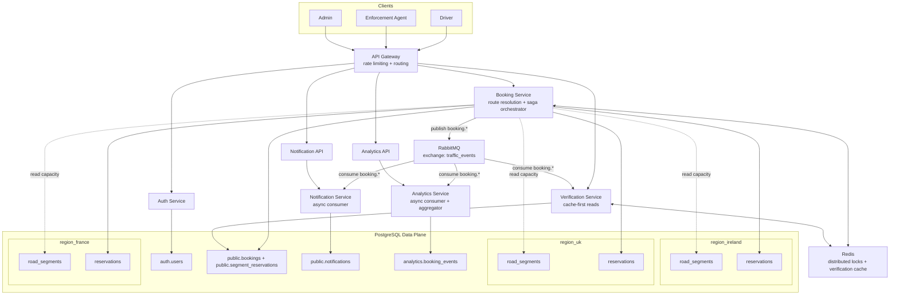

# Architecture

## Overview

Six microservices behind an API Gateway, deployed on AWS with Docker containers. Road network data is geo-partitioned by region (Ireland, UK, France) within PostgreSQL schemas, simulating separate regional databases.

## Region-First Architecture Diagram

## Reading Notes

- Geographic distribution is represented as regional partitions (`region_ireland`, `region_uk`, `region_france`) in PostgreSQL. In production these map to independent regional databases.
- Cross-region journeys are coordinated by the Booking Service saga orchestrator: reserve per region, then compensate (cancel) if any regional step fails.
- Redis supports distributed locking for segment+slot reservation and low-latency verification reads.
- RabbitMQ decouples side effects from booking latency: notifications and analytics are processed asynchronously.

## Services

| Service | Responsibility |
|---|---|
| API Gateway (8000) | Edge routing, rate limiting, CORS |
| Auth Service (8001) | JWT auth, user management |
| Booking Service (8002) | Journey booking, saga orchestration |
| Verification Service (8003) | Plate number lookup, cache-first |
| Notification Service (8004) | Async notifications via RabbitMQ |
| Analytics Service (8005) | Event aggregation and reporting |

## Data Flow

1. Driver registers/logs in via Auth Service → JWT issued
2. Driver submits booking request to Booking Service
3. Booking Service resolves route via shortest-path graph search over `road_segments`, then groups segments by region
4. Saga orchestrator acquires distributed locks (Redis) per segment slot
5. Reserves capacity in each regional schema
6. On success: publishes `booking.confirmed` to RabbitMQ
7. Notification Service and Analytics Service consume the event
8. Enforcement agent calls Verification Service with plate number
9. Verification Service checks Redis cache first, then DB
